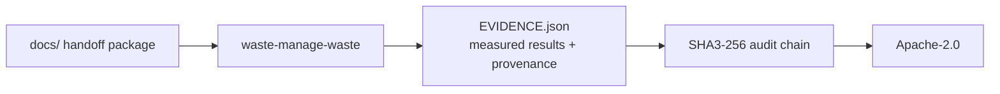

# WASTE

   

> Full evidence: `OFFICIAL_BENCHMARKS/` · lab: `ISOLATED_LAB_RESULTS/` (where present).

| | |
|---|---|
| Collection | WASTE MANAGEMENT |
| Vendor | Anticloud FZ LLE |
| Licence | Apache-2.0 + Enterprise commercial dual (Anticommons 1.0) |
| Payload | documentation, evidence and licence material |

## What this project is

Full evidence: `OFFICIAL_BENCHMARKS/` · lab: `ISOLATED_LAB_RESULTS/` (where present).

**Scope honesty:** no model decoding path ships in this project. It is a deterministic/offline component with AIOSS-style audit wiring. PAX may call it as a tool; no inference is claimed here.

## Architecture



## Install

```bash
# No executable package manifest was detected in this project.
# This repository ships documentation, evidence and licence material.
# See docs/ for the full handoff package.
```

Detected stack: docs-only

## Evidence and measured results

**NOT MEASURED.** No results file in this project carries both a value and run provenance (commit or date), so no benchmark number is claimed here. This is deliberate: Anticloud FZ LLE does not publish unmeasured scores.

## Millennium problem proposals

This project packages Anticloud Millennium problem proposals: P01, P02, P03, P04, P05, P06, P07, P08, P09, P10, P11, P12, P13, P14.

Proposals are shipped as PDFs under `25_MILLENNIUM_PROBLEM_PROPOSALS/` in the internal handoff tree and summarised in `docs/`.

## Documentation map

- `01_INVESTOR_PACKAGE/`
- `10_TECHNICAL_HANDOFF/`
- `25_MILLENNIUM_PROBLEM_PROPOSALS/`
- `28_TECHNICAL_WHITEPAPER/`
- `29_INVESTOR_MEMO/`
- `30_LOI/`

## Licence

Licensed under **Apache-2.0 + Enterprise commercial dual (Anticommons 1.0)**. See `LICENSE` and `NOTICE.md`. Apache-2.0 governs the open-source component; commercial use inside closed enterprise products is governed by the Anticloud Enterprise licence.

SPDX-License-Identifier: Apache-2.0
